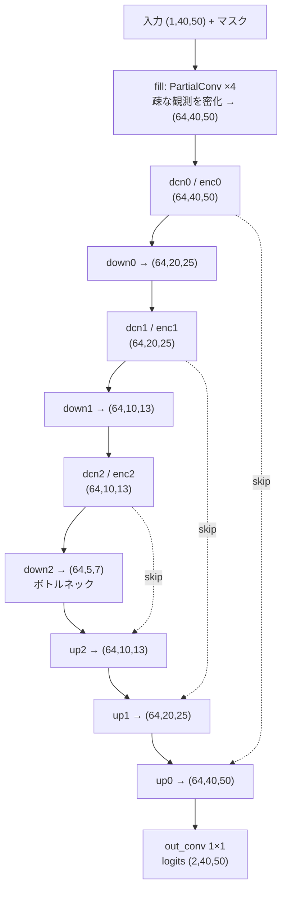

# 屋内障害物マップ推定 — 疎な電波強度観測からのセマンティックセグメンテーション

疎に観測された無線信号強度（RSS）から、屋内の障害物レイアウトを推定する深層学習モデルです。
観測点の位置に測定誤差が含まれる現実的な条件を想定し、**Partial Convolution + Deformable
Convolution v2 + 残差学習** を組み合わせた U-Net を PyTorch で実装しました。

修士研究として個人で設計・実装・実験を行ったものです（コードのみ公開）。

---

## 課題設定

屋内に設置した1台の送信機からの電波強度を、室内の一部の地点で測定します。
その疎な観測値から、**どこに障害物があるか**を 40×50 のグリッドで推定します。

| 項目 | 内容 |
|---|---|
| 入力 | 40×50 グリッド上の疎な RSS 観測（100〜1200点／全2000セル、つまり **5〜60% しか観測できない**）。最小条件の100点では**欠損率 95%** |
| 出力 | 各セルの2値ラベル（フリースペース / 障害物） |
| 難しさ① | **観測が疎**。大半のセルが欠損で、通常の畳み込みがそのままでは使えない |
| 難しさ② | **観測点の位置に誤差**がある。「どこで測ったか」自体が不正確 |
| 難しさ③ | **クラス不均衡**。障害物セルは全体の約1% |

## アプローチ

3つの技術を組み合わせて上記の課題に対処しました。

**① Partial Convolution（欠損への対処）**
欠損セルを単純にゼロ埋めすると、畳み込みが「電波強度ゼロ」と誤解します。
マスクを伝播させ有効画素だけで正規化する Partial Convolution を4層重ね、
疎な観測を段階的に密な特徴マップへ埋めます。

層数とカーネルサイズは恣意的に決めていません。**欠損マスクの距離変換**から
「最も遠い欠損セルが最近傍の観測点に到達するまでに必要な距離」を最疎条件（100点）の
最悪ケースで解析し（最大約15セル）、実効到達距離 (k−1)/2 × N がこれを被覆する
**最小の層数構成**として **カーネル 9×9 × 4層**（到達16セル）を採用しました。

**② 残差学習（学習しやすさの向上）**
生の RSS をそのまま入力せず、**対数距離経路損失モデル**による理論値との**差分**を学習対象にします。

```
F(p) = P_0 − 10 n log10( max(‖p − t‖, d_0) / d_0 )       t: 送信機位置
```

経路損失指数 `n` と基準受信電力 `P_0` は固定値ではなく、**学習データの疎な観測点から
最小二乗回帰して決定**します（完全なマップに依存しません）。
距離による自明な減衰をモデルが学習し直す必要がなくなり、「障害物による異常な減衰」に集中できます。
なお実装上の変数名・ファイル名には `fspl` を用いていますが、指すものは上式の対数距離モデルです。

**③ Deformable Convolution v2（位置誤差への対処）**
測位誤差で観測点がずれている前提で、サンプリング位置自体を特徴から学習して補正します。

**④ クラス重み付き損失（不均衡への対処）**
障害物セルが約1%しかないため、素の交差エントロピーでは「全セルをフリースペース」と答える解に
引っ張られます。そこでクラス頻度に応じた重み付き交差エントロピーを用いますが、重みは完全な
逆頻度（1/頻度）ではなく **sqrt 逆頻度**（1/√頻度）としました。完全逆頻度では少数クラスを
過度に重視して障害物の過検出を招くため、緩和した重み付けを選んでいます（重み比は約 9.4 : 1）。
さらに領域の重なりを直接最適化する **Dice 損失を α 倍して併用**し、画素単位の判定と領域全体の
一致の両方を目的関数に反映させます（α はハイパーパラメータ探索の対象）。

### ネットワーク構造



エンコーダの各解像度に DCNv2 ブロックを配置したマルチスケール構成です。
DCNv2 ブロック内部では、入力が2経路に分岐します。

```
入力 x ─┬─ offset_conv: Conv2d(64→27)  → オフセット Δp(18ch) + 変調 Δm(9ch, sigmoid)
        │                                          │
        └─ deform: DeformConv2d(64→64) ←───────────┘  Δp,Δm がサンプリング位置と重みを制御
                        └→ BatchNorm → ReLU
```

総パラメータ数 約162万（うち DCN のオフセット推定層が約4.7万）。

## 技術的に工夫した点

### 公平な比較のための実験設計
DCN と残差学習それぞれの寄与を切り分けるため、3条件のアブレーションを組みました。

| 条件 | 構成 | 検証対象 |
|---|---|---|
| ① | Partial Conv + 通常 Conv（DCNなし）+ 残差 | ①vs③ → **DCN の効果** |
| ② | Partial Conv + DCN + 生RSS | ②vs③ → **残差学習の効果** |
| ③ | Partial Conv + DCN + 残差（提案手法） | — |

当初は提案手法③でハイパーパラメータを探索し、その値を①②にも適用する設計でした。
しかしこれでは**③に有利な条件で比較してしまう**ことに気づき、**条件ごとに独立して
探索する設計**に組み直しました。探索は2段階で、まず損失重みを固定して学習率2通りを比較し、
選ばれた学習率のもとで損失重み9通りを探索します（1条件あたり 2+9 = 11本、3条件で33本）。

### 統計的に厳密な条件比較
条件間の差が小さかったため、平均値の比較では結論を出せないと判断し、以下を実装しました。

- **per-image ペア検定**：同一テスト画像でのペア比較（Wilcoxon 符号順位検定）により、
  画像ごとの難易度差を相殺
- **効果量の併記**：p 値が有意でも実質的な差が小さい場合を見分ける
- **学習シードの揺れとの比較**：複数シードで学習し、条件間差が
  「再現性のばらつき」を超えているかを判定

### 誤差の要因分解ツール
「どこを改善すべきか」を推測ではなくデータで決めるため、失点を排他的な4費目
（未検出 / 誤検出 / 形状 / 重心）に分解する診断を実装しました。
予測とGTを連結成分に分解して IoU でマッチングし、重心を整数セル平行移動して
重ねることで「形状の誤差」と「位置ずれの誤差」を分離します。
分解結果が独立に数えた総誤差と一致することを検証しています（残差 0.00%）。

### 長時間実験の運用性・再現性
ハイパーパラメータ探索33本と本評価36本（3条件 × 観測点数12水準）の計69本を、
数十時間かけて回す必要があったため、運用面も設計しました。

- **完了マーカー（`done.json`）によるレジューム** — 中断しても完了済みをスキップして再開
- **リアルタイム進捗表示** — 標準出力のバッファリングに影響されないよう、
  CSV ログを直接読む監視スクリプトを別途用意
- **再現性の担保** — 乱数シードを `random`/`numpy`/`torch`/DataLoader すべてに適用し、
  初期重みのハッシュで「シードが実際に効いていること」「同一シードで再現すること」を検証
- **実験の分離** — 設定違いの実験は出力先ディレクトリを分け、既存結果を上書きしない設計

## 技術スタック

Python 3.10 / PyTorch 2.x / torchvision（`DeformConv2d`）/ NumPy / SciPy（連結成分・統計検定）/ matplotlib
